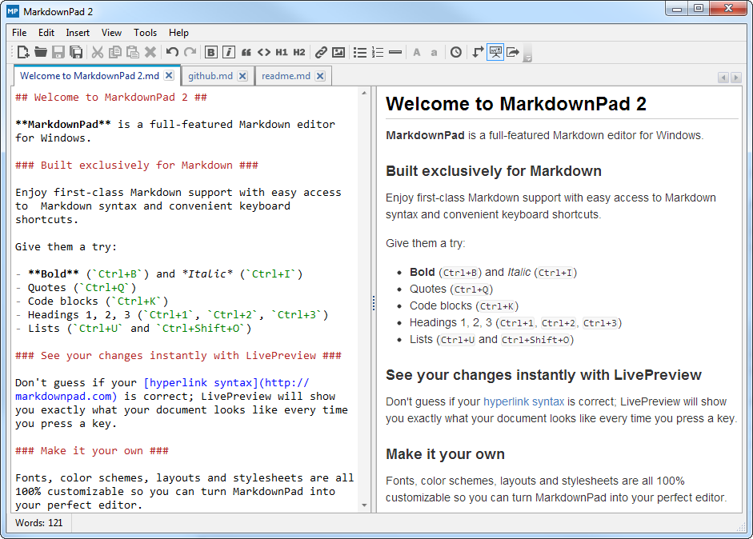

theme: Next, 9
footer: _\#md4what - @pzimat_

# [fit] Markdown for What!?

#### Patrik Affentranger

---

## Who!?


- Patrik Affentranger

---

## Who!?


 

- Patrik Affentranger
- Front End Web Developer @ hatchd

---

## Who!?


- Patrik Affentranger
- Front End Web Developer @ hatchd
- Originally from Switzerland 🇨🇭

---

## Who!?


- Patrik Affentranger
- Front End Web Developer @ hatchd
- Originally from Switzerland
- Have been using Markdown  
  for the last 8 years ...

---

## Who!?


- Patrik Affentranger
- Front End Web Developer @ hatchd
- Originally from Switzerland
- Have been using Markdown
  for the last 8 years ...
- ... and still :heart: it.

---
[.build-lists]
## ~~Markwhat?~~ Markdown

- Released in December 2004[^1]
- Implemented for >15 programming languages
- Over 30 flavours
- Simple way of formatting text
- Language to create **rich text** from *plain text*


[^1]: https://daringfireball.net/projects/markdown/

---

## Purpose

>"to be used as a format for writing for the web."

- Inspired by plain-text email
- Platform agnostic
- Publishable as-is
- No need to be a coder

<br>
<br>

_[^img]_


[^img]: Source: https://www.getresponse.com/blog/still-send-plain-text-versions-emails

---
[.hide-footer]


---
[.build-lists]

## Flavours

- CommonMark
- GitHub Flavored
- iA Writer's Markdown
- Leanpub
- Trello's Markdown

---

### Apps that understand Markdown

| App | Web | App & Web |
| ---- | --- | --------- |
| iA Writer | CodePen | Slack |
| Deckset | GitHub | Notion |
| Simplenote | WordPress | |
| So... | many... | more... |

---

## Examples
#### iA Writer


---

## Examples
#### Deckset


---

## Examples
#### Macdown


---

## Examples
#### Markdownpad 2



---

## Examples
#### WordPress (plugin[^3])


[^3]: WP Githuber MD: https://wordpress.org/plugins/wp-githuber-md/

---

# The Basics

---

## Paragraphs?

One or more lines of text separated by one or more blank lines.

---

## Paragraphs!

One or more lines of text separated by one or more blank lines.


#### Example:

This is the 1st line of text.

This is the 2nd line of text.

---

## Emphasis?

To create bold or italic text, wrap text with asterisks `*` or underscores `_`.

---

## Emphasis!

To create bold or italic text, wrap text with asterisks `*` or underscores `_`.

#### Example:

\*Italic Text\* => *Italic text*

\*\*Bold Text\*\* => **Bold text**

\*\*\_Bold Text\_\*\*\_ => **_Bold & italic text_**

---

## Headings?

To create a heading, start a line with a hash `#` and a space.

---

## Headings!

To create a heading, start a line with a hash `#` and a space.

#### Example:

# \# Heading 1

## \#\# Heading 2

#### ...

###### \#\#\#\#\#\# Heading 6

---

## Lists?

2 types of lists:

**unordered**, using `*`, `+`, `-`

**ordered**, using  1., 2., 3. etc.

---

## Unordered Lists!

Uses `*`, `+`, `-`

#### Example: 

* * List item 
+ + List item
- - List item

---

## Ordered Lists!

Uses 1., 2., 3. etc.

#### Example: 

1. 1. List item
2. 2. List item
3. 3. List item

---

## Links?

To create a link, enclose some text with square brackets `[]`, followed by the URL wrapped in parenthesis `()`.

---

## Links!

To create a link, enclose some text with square brackets `[]`, followed by the URL wrapped in parenthesis `()`.

#### Example:

\[Link text](http://www.google.com) => [Link text](http://www.google.com)

---

## Images?

Images are very similar to links, except it starts with an exclamation mark `!`.

---

## Images!

Images are very similar to links, except it starts with an exclamation mark `!`.

#### Example:

\!\[alternative text](path/to/file.jpg) => 

---

## Block quotes?

To create a block quote, start the line of text with a great than symbol \>.

---

## Block quotes!

To create a block quote, start the line of text with a great than symbol \>.

#### Example:

\> Love a good quote.

=>

> Love a good quote


---

## [fit] Advanced Concepts

---

## Nested Lists?

Lists can be nested multiple levels using 4 spaces per level.

---

## Nested Lists!

Lists can be nested multiple levels using 4 spaces per level.

#### Example:

* * Item
    1. 1. Second level
        - - Subitem

---

## Links as References?

Instead of having links inline with the text, they can placed at the bottom of the file as references.

---

## Links as References!

Instead of having links inline with the text, they can placed at the bottom of the file as references.

#### Example:

\[Link text]\[id] => [Link text][id]

Blocks of other content.

\[id]: http://www.google.com


[id]: http://www.google.com

---

## Image Links?

To create an image link, wrap the image in square brackets `[]`, followed by the URL in parenthesis `()`.

---

## Image Links!

To create an image link, wrap the image in square brackets `[]`, followed by the URL in parenthesis `()`.

#### Example:

\[\!\[alternative text](path/to/file.jpg)]\(http://www.google.com)

[](http://www.google.com)

---

## Code?

2 types of code:

**inline**, wrap text in a single back-tick \`.

**block**, wrap a block of code with 3 back-ticks \```.

<br />

This will use a fixed-with font and display every character inside exactly as it was typed.

---

## Inline Code!

To mark text as inline code, wrap text in single back-ticks ` ` `.

#### Example:

\`helloWorld()\` => `helloWorld()`

---

## Code Block!

To define a code block, place three back-ticks above and below the code.


#### Example:

\```
var helloWorld = “Hello World”;
console.log(helloWorld);

\```

---

## Let’s get started!

### Try it

[commonmark.org/help/tutorial][commonmark-tutorial]  (⏰ 10')

### Cheatsheet

[devhints.io/markdown][cheatsheet]

---

## Go for Gold :star:

:point_right: [dillinger.io][dillinger]  (⏰ 15')

| Easy | More complex |
| ------ | ------------ |
| To-do list | Resume |
| Blog post | Weekly plan |
| Manual for a new tool /<br>appliance | Method for a recipe |


[cheatsheet]: https://devhints.io/markdown
[markdown-tutorial]: https://www.markdowntutorial.com/
[commonmark-tutorial]: https://commonmark.org/help/tutorial
[dillinger]: https://dillinger.io/