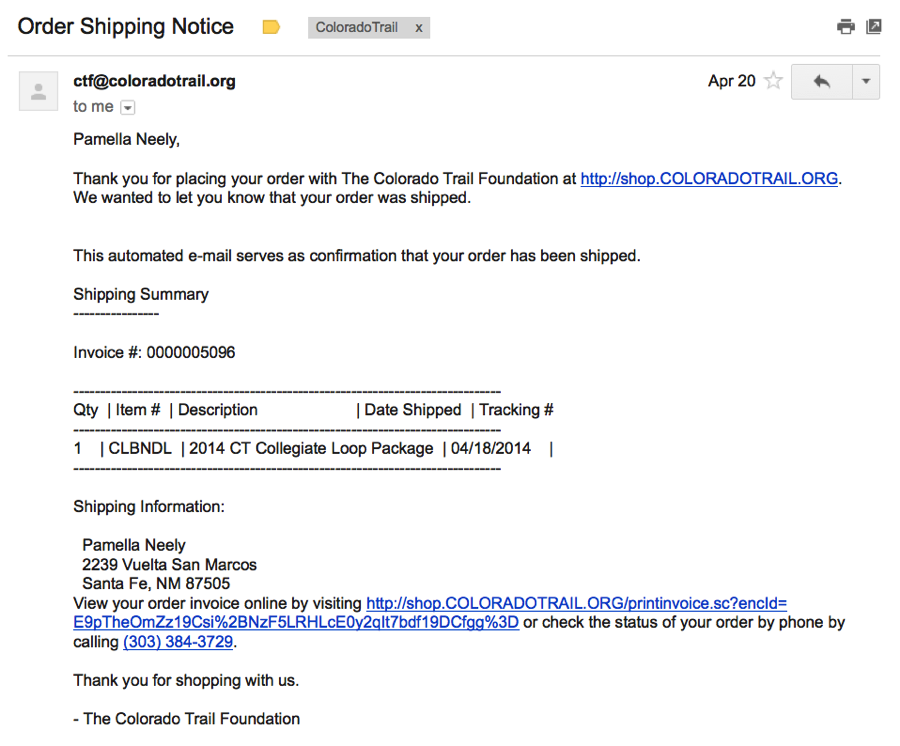
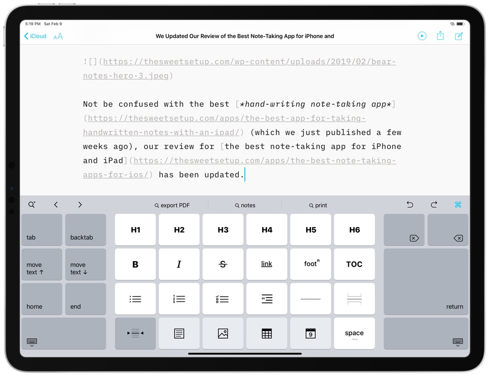

theme: Next, 9
footer: _\#md4what - @pzimat_

# [fit] Markdown for What!?

#### Patrik Affentranger

^ Welcome... 
Who has heard of Markdown? 
Who has used Markdown? 
Gonna tell you what it is, why you should use it, how you could use it

---

## Who!?

- Patrik Affentranger

---

## Who!?

 

- Patrik Affentranger
- Front End Web Developer @ hatchd

---

## Who!?

- Patrik Affentranger
- Front End Web Developer @ hatchd
- Originally from Switzerland 🇨🇭

---

## Who!?

- Patrik Affentranger
- Front End Web Developer @ hatchd
- Originally from Switzerland 🇨🇭
- Have been using Markdown  
  for the last 8 years

---

## Who!?

- Patrik Affentranger
- Front End Web Developer @ hatchd
- Originally from Switzerland 🇨🇭
- Have been using Markdown  
  for the last 8 years
- ... and still :heart: it.

^ ... and I hope I can demonstrate why I love it. 
But before we do that, what is...

---

[.build-lists]

## ~~Markwhat?~~ Markdown

- A simple way of formatting text
- Language to create **rich text** from *plain text*
- Very versatile
- Released in December 2004[^1]

[^1]: https://daringfireball.net/projects/markdown/

^
*Formatting*: Headings, bold, italic, lists, links, images, tables, etc. 
*Can transform into HTML* 
*versatile*: simple notes, blog posts, documentation, books, this presentation 
*15 years...*

---

[.build-lists]

## Purpose

> "to be used as a format for writing for the web."
 

- Inspired by plain-text email :arrow_right:
- Publishable as-is
- Platform agnostic
- No need to be a coder

 
 

_[^img]_

[^img]: Source: https://www.getresponse.com/blog/still-send-plain-text-versions-emails

^ Anyone/anything can read it and grasp it, it's just punctuation. Lists look like lists. 
Used by millions all around the globe. 
*Next:* Why would I use Markdown?

---
[.hide-footer]

^ Too many options... toolbars, buttons, fluff... distractions!

^ Writage, a tool to edit Markdown in Word 😏

---

## Apps that understand Markdown

| App | Web | App & Web |
| ---- | --- | --------- |
| iA Writer | CodePen | Slack |
| Deckset | GitHub | Notion |
| Simplenote | WordPress | Trello |
| So... | many... | more... |

---

## Examples
#### iA Writer

---

## Examples
#### Macdown

---

## Examples
#### Markdownpad 2

---

## Examples
#### WordPress (plugin[^2])

[^2]: WP Githuber MD: https://wordpress.org/plugins/wp-githuber-md/

^ Wordpress Plugin called Githuber MD 
Next, the basics...

---

# The Basic Basics

#### (for writing Markdown)

---

## Paragraphs?

One or more lines of text separated by one or more blank lines.

#### Write this:

This is the first line of text.

This is the second line of text.

---

## Paragraphs!

One or more lines of text separated by one or more blank lines.

#### Get that:

This is the first line of text.

This is the second line of text.

---

## Emphasis?

To create bold or italic text, wrap text with asterisks `*` or underscores `_`.

#### Write this:

\*Italic text\*

\*\*Bold text\*\*

\*\*\_Bold & italic text\_\*\*

---

## Emphasis!

To create bold or italic text, wrap text with asterisks `*` or underscores `_`.

#### Get that:

*Italic text*

**Bold text**

**_Bold & italic text_**

---

## Headings?

To create a heading, start a line with a hash `#` and a space.

#### Write this:

\# Heading 1

\#\# Heading 2

\#\#\# Heading 3

---

## Headings!

To create a heading, start a line with a hash `#` and a space.

#### Get that:

# Heading 1

## Heading 2

### Heading 3

---

## Lists?

2 types of lists, *unordered* and *ordered*.

Using `*` or `-` OR  1., 2., 3. etc.

#### Write this:

\* List item

1. List item

---

## Lists!

2 types of lists, *unordered* and *ordered*.

Using `*` or `-` OR  1., 2., 3. etc.

#### Get that:

* List item

1. List item

---

## Links?

To create a link, enclose some text with square brackets `[]`, followed by the URL wrapped in parenthesis `()`.

#### Write this:

\[Link text](http://www.google.com)

---

## Links!

To create a link, enclose some text with square brackets `[]`, followed by the URL wrapped in parenthesis `()`.

#### Get that:

[Link text](http://www.google.com)

---

## Images?

Images are very similar to links, except they start with an exclamation mark `!`.

#### Write this:

\!\[alternative text](path/to/file.jpg)

---

## Images!

Images are very similar to links, except they start with an exclamation mark `!`.

#### Get that:

---

## All you need is   

## `*  -  #  [ ]  ( ) !`

---

## Let’s get started!

### Try it

[commonmark.org/help/tutorial][commonmark-tutorial]  (⏰ 10-15')

### Cheatsheet

[commonmark.org/help][cheatsheet]

^ Check-in after 10 minutes

---

## Go for Gold :point_right: [dillinger.io][dillinger]  (⏰ 20')

| Simple | Complex |
| ------ | ------------ |
| To-do list | Table |
| Nested list | Method for a recipe |
| Blog post | Resume |
| Manual for an appliance | Weekly plan |

---

## References

- [Daring Fireball](https://daringfireball.net/projects/markdown/)
- [CommonMark](https://commonmark.org/)
- [Markdown Cheatsheet][cheatsheet]
- [Markdown Tutorial][markdown-tutorial]
- [Awesome Markdown][awesome-markdown]

---

## Resources / apps

- [dillinger.io][dillinger] / [StackEdit][stackedit]
- [Marp][marp] / [Deckset][deckset]
- [MarkdownPad][markdownpad] / [Macdown][macdown]
- [iA Writer][iAWriter]

---

## Thanks

# :pray:

###### Slides:  [md4what.surge.sh][md4whatslides]

[cheatsheet]: https://commonmark.org/help/
[markdown-tutorial]: https://www.markdowntutorial.com/
[commonmark-tutorial]: https://commonmark.org/help/tutorial
[dillinger]: https://dillinger.io/
[stackedit]: https://stackedit.io/
[iAWriter]: https://ia.net/writer
[markdownpad]: http://markdownpad.com/
[macdown]: https://macdown.uranusjr.com
[marp]: https://yhatt.github.io/marp/
[deckset]: https://www.deckset.com
[writage]: http://www.writage.com/
[awesome-markdown]: https://github.com/mundimark/awesome-markdown
[md4whatslides]: https://md4what.surge.sh